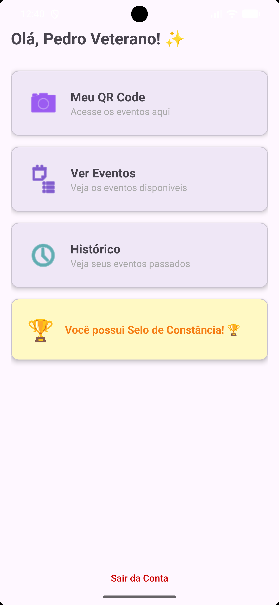
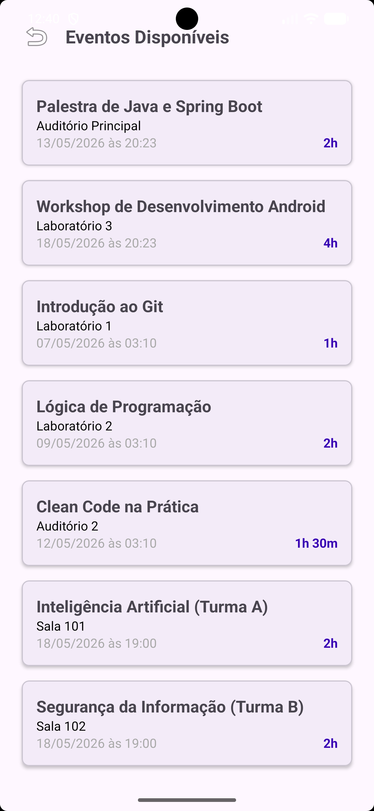
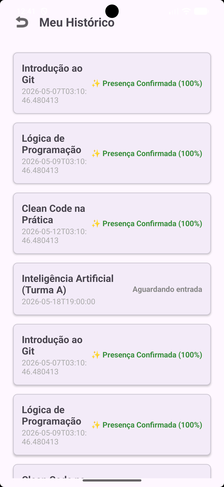
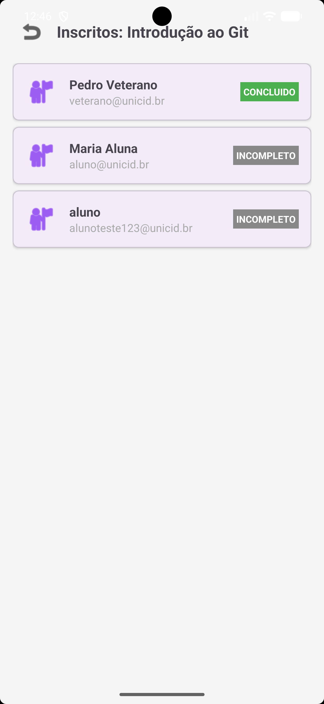

# EasyPres - Sistema de Controle de Atividades Acadêmicas 🎓

O **EasyPres** é uma solução mobile completa para a gestão de eventos acadêmicos. O sistema automatiza todo o ciclo de vida de um evento, desde a criação pelos organizadores até a certificação dos alunos através de um controle de presença inteligente via QR Code.

---

## 📱 Demonstração do Aplicativo

### 🏠 Dashboard Principal
O ponto central da experiência do aluno. Projetado sob as diretrizes do **Material Design 3**, o dashboard oferece acesso intuitivo e rápido aos eventos disponíveis.
*   **Gestão de Status:** Exibição imediata das participações ativas.
*   **UX Otimizada:** Redução da carga cognitiva para que o aluno encontre o que precisa em segundos.

  

---

### 🔐 Check-in Inteligente (QR Code)
O diferencial técnico do projeto. O aluno gera um QR Code dinâmico que carrega informações de identidade e timestamp para validação.
*   **Agilidade:** Interface de alto contraste para garantir leitura instantânea pelo scanner.
*   **Segurança:** Previne fraudes de presença através de validação temporal no backend.

  

---

📂 <strong>Clique para ver o ecossistema completo (Catálogo, Histórico e Admin)</strong>

 

| **Catálogo de Eventos** | **Histórico de Presença** | **Painel do Organizador** |
| :---: | :---: | :---: |
|  |  |  |
| Inscrição fluida em novas atividades acadêmicas. | Acompanhamento de progresso e selos de mérito. | Gestão completa de inscritos e eventos. |

---

## ✨ Funcionalidades Principais

#### 👨‍🎓 Módulo do Aluno
*   **Catálogo Inteligente:** Explore eventos e realize inscrições com um toque via API REST.
*   **Barra de Progresso:** Acompanhamento visual da carga horária cumprida em tempo real.
*   **Selo Badge de Ouro:** Reconhecimento automático para alunos com mais de 80% de assiduidade.

#### 👨‍💼 Módulo do Organizador
*   **Gestão Administrativa:** CRUD completo de eventos com definição de carga horária.
*   **Controle de Lista:** Visualização de inscritos com filtro inteligente contra duplicatas.

---

## 🛠️ Stack Tecnológica e Engenharia

O projeto foi estruturado focando em **escalabilidade** e **manutenibilidade**, utilizando o que há de mais moderno no ecossistema Android nativo:

*   **Linguagem:** Java (JDK 11) com foco em tipagem forte e segurança de dados.
*   **Networking:** [Retrofit 2](https://square.github.io/retrofit/) + GSON para consumo de APIs assíncronas e serialização de objetos.
*   **UI/UX:** Material Design 3 (Material You) com componentes dinâmicos e adaptativos.
*   **QR System:** [ZXing](https://github.com/zxing/zxing) integrado para processamento de imagem e geração de bitmaps.
*   **Arquitetura:** Baseada no padrão de separação de responsabilidades (Separation of Concerns), garantindo que a lógica de negócio (Network/API) seja independente da camada de apresentação (Adapters/Activities).

---

## 📏 Regras de Negócio e Algoritmos

Diferente de sistemas de presença convencionais, o **EasyPres** implementa um algoritmo de validação de carga horária para garantir a integridade da certificação:

1.  **Check-in/Out Pareado:** O sistema exige a marcação de entrada e saída, calculando o delta de tempo real.
2.  **Cálculo de Assiduidade:** Implementação da lógica `(TempoPermanencia / CargaHorariaEvento) * 100`.
3.  **Gatilho de Recompensa (Gamificação):** Caso a assiduidade seja `>= 80%`, o status é promovido para `CONCLUÍDO` e o `Badge de Ouro` 🏆 é injetado no perfil do aluno, simulando um critério real de aprovação acadêmica.

---

## 🚀 Como Executar o Projeto

1.  **Clonagem:** `git clone https://github.com/Pereira-gu/GA-evento-app.git`
2.  **Configuração:** Abra no Android Studio e aguarde a sincronização do Gradle.
3.  **Execução:** Conecte um dispositivo (API 24+) e clique em `Run`.

---

## 📄 Licença

Este projeto está sob a licença MIT. Consulte o arquivo [LICENSE](LICENSE) para mais detalhes.

---

Desenvolvido por <strong>Gustavo Pereira</strong>

